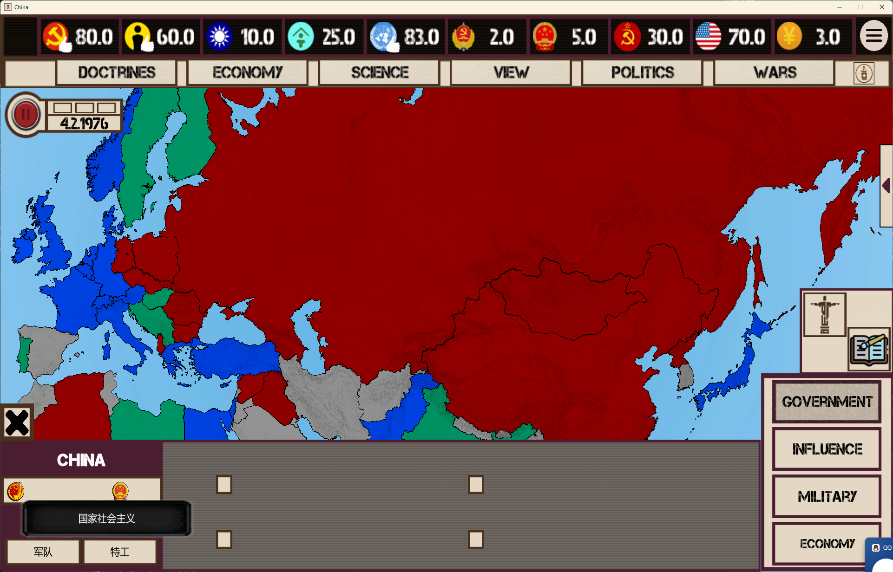
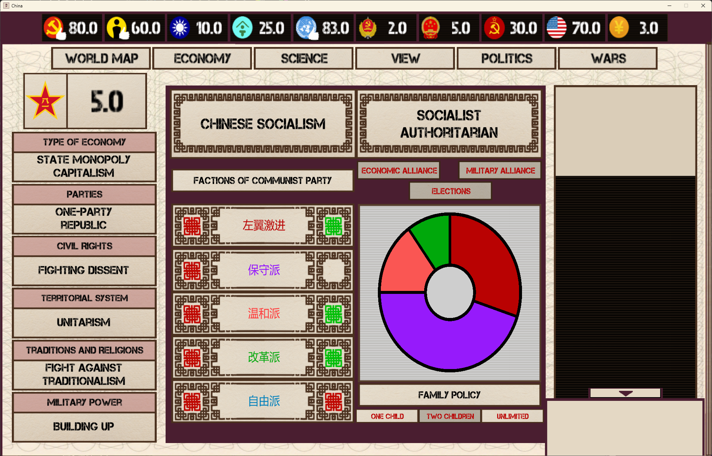
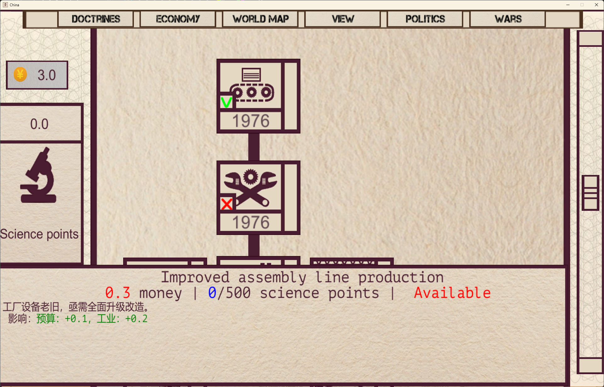
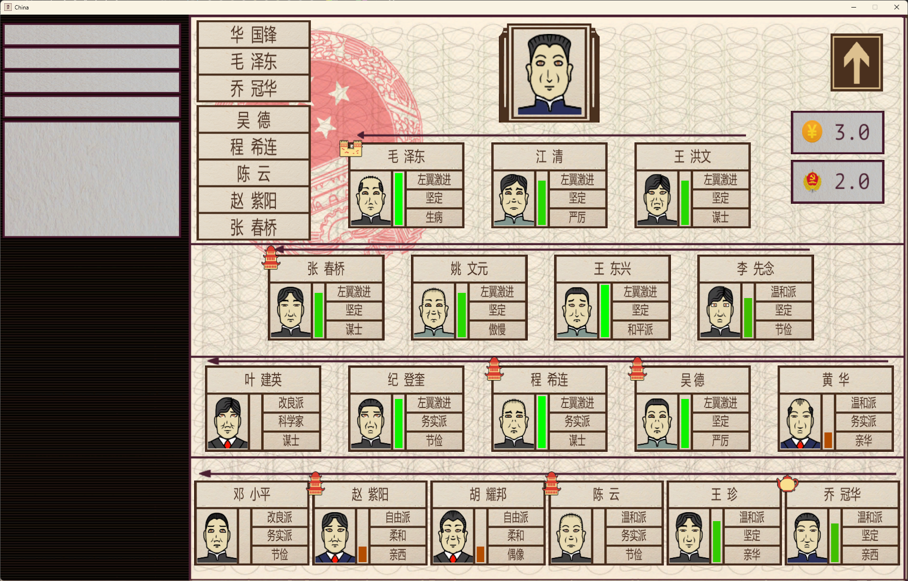
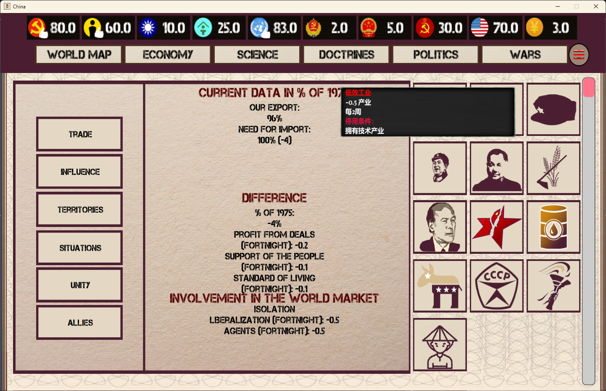

# 针对《Mao's Legacy》游戏的解包后文件的批量汉化的汉化工具

## 目前翻译版本针对游戏1.7.9.2

### 如果遇到翻译问题请发issues等，部分文本我尚未找到位置，还有些内容是贴图或可能是矢量的，我目前还不太会处理这些东西，等我研究好了就把工具做完整。

#### 示范如下：

## 本工具介绍

* 本工具主要打开和解析 UABEA 解包出来的JSON文件，代码中做了一些针对游戏的特殊处理，主要是针对一些文本的特殊处理，或类XML结构的支持等。
* 创建Python虚拟环境，安装依赖包，配置.env 文件，然后执行python main.py即可打开工具网页。
