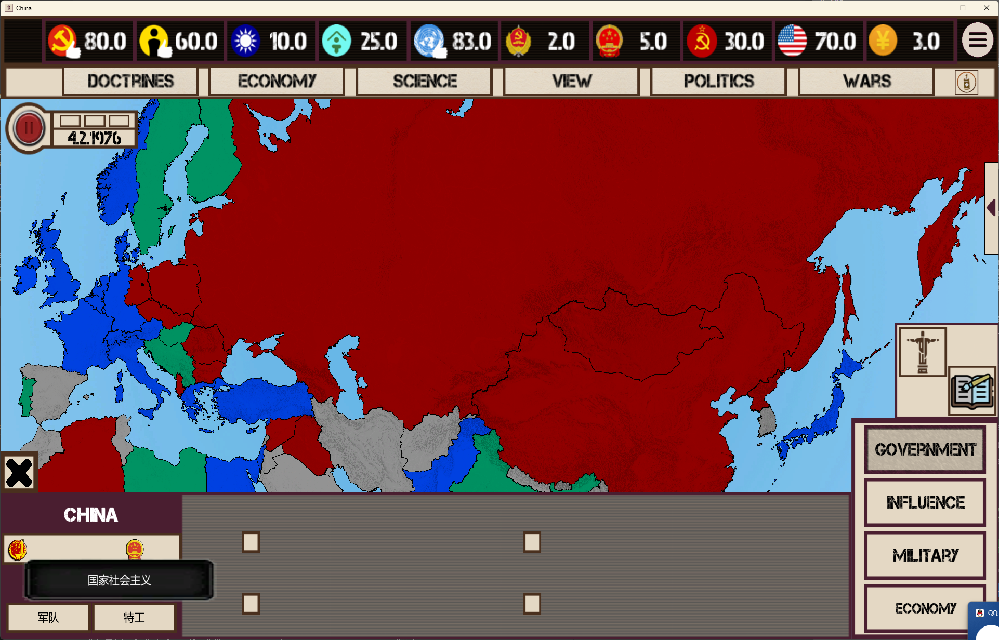
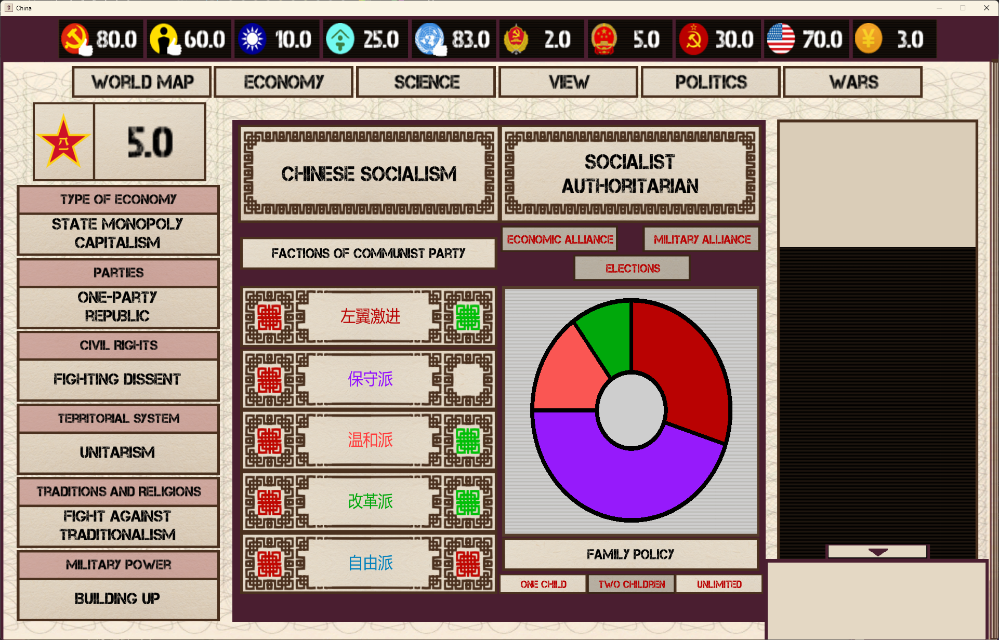
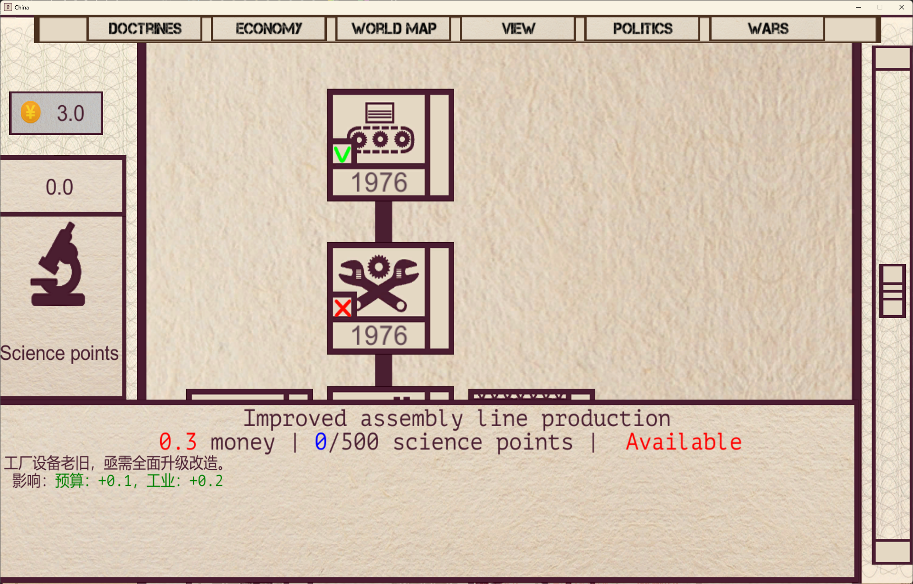
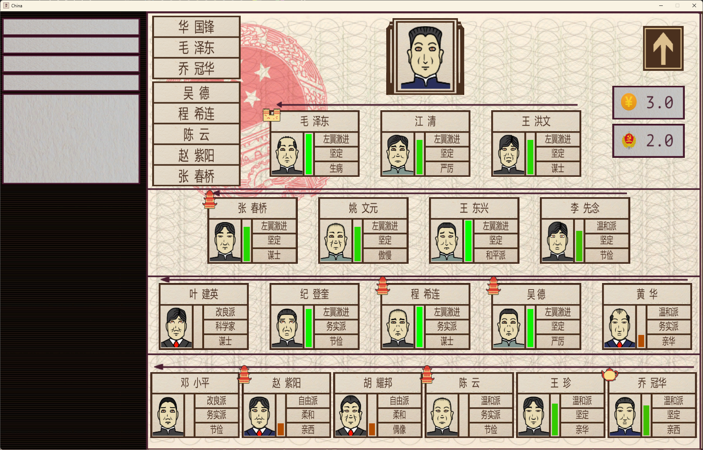
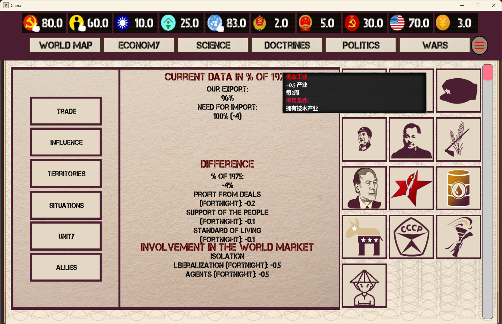

# Mao's Legacy 毛泽东的遗产 — 中文汉化补丁

> **版本**: v1.8.5 · 适配 Steam 版 1.8.5 (2026-06-03)

本仓库提供 **《毛泽东的遗产》(Mao's Legacy)** 游戏的完整中文汉化工具与成品补丁。

- **翻译覆盖率**: DLL 内硬编码字符串约 99%、解包文本 100%、Level UI 18 个场景
- **字体**: LXGW WenKai Mono v1.522 (开源楷体风格等宽中文字体)

---

## 汉化补丁使用说明 (玩家指南)

如果你只是想玩汉化版游戏，按以下步骤安装即可，**无需运行任何 Python 脚本**。

### 第一步: 确认游戏版本

本补丁针对 Steam 版 **1.8.5** (截至 2026-06-03 的最新版本)。
如果你的游戏版本不同，**请勿安装**，否则会导致游戏无法启动或文本错乱。

### 第二步: 备份原文件

进入游戏的安装目录:
```
C:\Program Files (x86)\Steam\steamapps\common\Mao's Legacy\China_Data\
```

备份以下文件 (建议复制到安全位置，万一出问题可以还原):
- `China_Data\Managed\Assembly-CSharp.dll`
- `China_Data\resources.assets`
- `China_Data\sharedassets3.assets`
- `China_Data\sharedassets15.assets`
- `China_Data\sharedassets18.assets`
- `China_Data\level2`, `level3`, `level5` ... `level24` (共 18 个 level 文件)

### 第三步: 覆盖文件

将本仓库 [`1.8.5_output/`](./1.8.5_output/) 目录下的 **22 个文件** 复制到游戏目录:

| 输出文件 | 复制到 |
|---------|-------|
| `Assembly-CSharp.dll` | `China_Data\Managed\` |
| `resources.assets` | `China_Data\` |
| `sharedassets3.assets` | `China_Data\` |
| `sharedassets15.assets` | `China_Data\` |
| `sharedassets18.assets` | `China_Data\` |
| `level2` `level3` `level5` `level6` `level7` `level8` `level9` `level11` `level12` `level13` `level14` `level15` `level16` `level17` `level20` `level21` `level23` `level24` | `China_Data\` (18 个 level 文件) |

⚠️ **注意**: Windows 会提示"是否替换目标中的文件"，确认替换即可。

### 第四步: 启动游戏

直接启动游戏，语言会自动切换为中文。**不需要在设置里切换语言**，汉化是通过替换二进制文件实现的。

如果发现部分文本显示异常，检查:
1. 你的游戏版本是否是 1.8.5 (看启动器版本号)
2. 是否覆盖错了文件 (检查文件大小是否与 `1.8.5_output/` 下的一致)
3. 是否修改过游戏其他文件

### 已知未修复问题

以下问题超出汉化范围 (需要改游戏代码或 Unity prefab)，不在本补丁范围内:

| 问题 | 说明 |
|------|------|
| 经济面板浮点精度 | `-0.03333334` 这种显示，需改 C# `.ToString("F2")` |
| 短文本左对齐 | 个别短行文字贴着左边框，需改 Unity prefab |
| 5 首歌曲跳过 | Anthem of PRC/CPC 等歌名过长，音乐机列表显示为英文 |

---

## 示范截图











---

## 开发者: 重新生成补丁 (可选)

本仓库同时也包含汉化工具脚本。如果你想基于已有翻译重新生成补丁 (例如修改了中文文本、添加了新翻译)，按以下步骤操作。

### 环境准备

```bash
# 安装 uv (现代 Python 包管理器)
# https://astral.sh/uv

# 复制环境变量模板
cp .env.example .env
# 编辑 .env, 填入 OpenAI 兼容 API URL + Key (用于 LLM 翻译)

# 创建软链 (WSL 下访问 Windows 游戏目录的方式)
mkdir -p 1.8.5_Resources
ln -s "/mnt/c/Program Files (x86)/Steam/steamapps/common/Mao's Legacy/China_Data" 1.8.5_Resources/Data
```

### 运行汉化工具 (可选)

Web UI (用于人工校对 JSON 翻译):
```bash
uv run --with flask --with flask_cors --with python-dotenv python3 app.py
# → http://localhost:5000
```

### 重新生成补丁

按以下顺序跑 4 个管线，每条管线独立:

```bash
# 1. DLL 汉化 pipeline (提取→翻译→修复换行→patch)
uv run python3 extract_dll_strings.py
uv run python3 dll_translate.py
uv run python3 fix_wrap_and_title.py
uv run python3 dll_patch.py

# 2. 解包汉化 pipeline (注入已翻译的 JSON)
uv run --with UnityPy python3 inject_text_assets.py

# 3. Level 场景 patch
uv run python3 patch_levels.py

# 4. TextMesh / 字体注入
uv run --with UnityPy python3 patch_textmesh.py
```

所有输出文件会写入 `1.8.5_output/`，**不会修改原始游戏文件**。跑完后手动把 output 复制到游戏目录即可。

### 字节级验证 (重要)

跑完所有管线后，验证 in-place patch 文件 (DLL + level) 的大小与源文件完全一致:

```bash
for lvl in 1.8.5_output/level* 1.8.5_output/Assembly-CSharp.dll; do
  name=$(basename "$lvl")
  src="1.8.5_Resources/Data/$name"
  [ "$name" = "Assembly-CSharp.dll" ] && src="1.8.5_Resources/Data/Managed/$name"
  src_sz=$(wc -c < "$src")
  out_sz=$(wc -c < "$lvl")
  echo "$name: src=$src_sz  out=$out_sz  $( [ $src_sz -eq $out_sz ] && echo '✅' || echo '❌ 大小不等!')"
done
```

❗ **任何一行显示 ❌ 都不能部署到游戏，否则会损坏存档/崩溃。**

---

## 已知陷阱

详见 [`AGENTS.md`](./AGENTS.md)，主要包括:

- **DLL patch 必须精确填充 `available_chars × 2` 字节** (UTF-16LE + 空格)
- **Level 字符串 4 字节对齐** (patched block 必须与原件字节一致)
- **`resources.assets` 严格使用 `\r\n` 换行符** (错用 `\n` 会导致事件文本不显示)
- **`DENY_OFFSETS` 列表里的字符串绝不能翻译** (Unity 查找键，翻译会破坏游戏逻辑)

---

## 项目结构

```
.
├── 1.8.5_output/              # ← 汉化成品 (22 个文件，可直接部署)
├── text_assets/               # 解包文本 (en/ru/zh 对应)
├── dll_strings/               # DLL 字符串数据
├── decompiled/                # 反编译的 C# 源码 (用于字符串提取)
├── fonts/                     # LXGW WenKai Mono 字体源
├── translations_dict.json     # 集中双语字典
├── level_translations.py      # 18 个 level 的翻译表
├── level_translations_level17.py  # level17 教程专题翻译
├── AGENTS.md                  # 项目技术文档 (格式硬约束 / 陷阱)
└── *.py                       # 各管线脚本
```

---

## 致谢

- 游戏: [Mao's Legacy](https://store.steampowered.com/app/1928980/Maos_Legacy/) by Kremlingames
- 字体: [LXGW WenKai 霞鹜文楷](https://github.com/lxgw/LxgwWenKai) — SIL Open Font License 1.1
- 工具: UnityPy, fontTools, OpenAI-compatible LLM API
